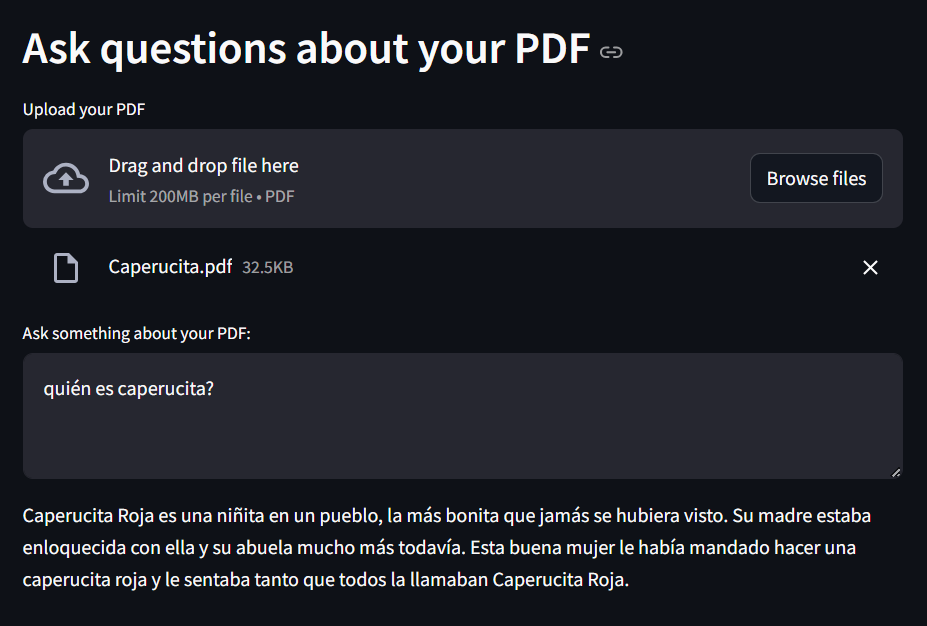

# Streamlit | PDF Chat Application

This project is created as a learning exercise, utilizing **LangChain** and **Streamlit**. The application allows you to upload a PDF file and ask questions about its content, using the OpenAI API to provide responses.

## Installation

Follow these steps to set up and run the project in your local environment:

### Step 1: Clone the Repository

```bash
git clone https://github.com/your_username/your_repository_name.git
cd your_repository_name
```

### Step 2: Create and activate the Virtual Environment

Create the virtual environment
```bash
python -m venv venv
```

Activate the virtual environment
```bash
venv\Scripts\activate
```

### Step 3: Install Requirements
Install all the dependencies listed in requirements.txt:
```bash
pip install -r requirements.txt
```

### Step 4: Run the application
Run the application using the following command:
```bash
streamlit run app.py
```

## Usage

### OpenAI API KEY
1. Rename the ``.env.example`` file to ``.env``.
2. Open the ``.env`` file and paste your OpenAI API Key into the file. It should look like this:
```bash
OPENAI_API_KEY=your_openai_api_key
```

### Upload a PDF and ask some questions
1. Open the application in your browser (usually at http://localhost:8501).
2. Upload the PDF file you want to ask questions about.
3. Type your question in the text field and get responses based on the content of the PDF.
